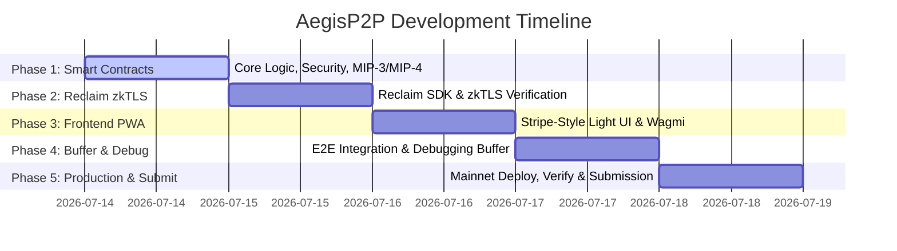

# AegisP2P: Implementation Roadmap

This document outlines the step-by-step phases to build and deploy **AegisP2P**, a ZK-Verified Fiat-to-Crypto Settlement Engine on Monad.

---

## Roadmap Overview

---

## Phase 1: Smart Contract Foundations & Security (July 14 - July 15)
**Objective:** Architect, secure, and deploy the core escrow engine.

*   [ ] **1.1. Project Setup:** Initialize the codebase repository and configure Foundry or Hardhat.
*   [ ] **1.2. Core Escrow Contract (AegisEscrow.sol):**
    *   `createEscrow(buyer, amount, recipient, reference)` - payable function. Stores raw fields, not a hash.
    *   `markAsPaid(escrowId)` - buyer locks escrow before sending fiat. Starts 2hr proof timer. Prevents front-running on refund.
    *   `verifyFiatAndRelease(escrowId, proof)` - replay protection via `usedClaims[proof.claimId]`, context binding (escrowId, contractAddress), expected JSON construction via `abi.encodePacked`, hash comparison, then zk verification.
    *   `refund(escrowId)` - timeout based. 2hr from `createEscrow` if still in `Funded`. 2hr from `markAsPaid` if in `AwaitingProof`.
    *   Escrow states: `Funded` -> `AwaitingProof` -> `Verified` | `Refunded`.
*   [ ] **1.3. Define On-Chain Events:**
    *   Events: `EscrowFunded`, `PaymentMarked`, `FiatVerified`, `EscrowRefunded`.
*   [ ] **1.4. Security:**
    *   `mapping(bytes32 => bool) public usedClaims` to prevent proof replay attacks.
    *   Context binding: proof context must contain `escrowId` and `address(this)`.
    *   `ReentrancyGuard` on release and refund functions.
    *   `Ownable2Step` for admin controls only.
    *   `Pausable` - only blocks `createEscrow`. Other functions always unpausable.
*   [ ] **1.5. Monad Network Integrations (MIP-3 & MIP-4):**
    *   **MIP-3 (Linear Memory):** Structure proof handling using Reclaim Solidity Verifier SDK. No string parsing.
    *   **MIP-4 (Reserve Balance Introspection):** Check address `0x1001` via `dippedIntoReserve()` before proof verification.
*   [ ] **1.6. Unit Testing:** Standard flow (fund -> markAsPaid -> verify -> release), timeout refund from Funded, timeout refund from AwaitingProof, replay attack (same proof twice fails), wrong escrow context (proof bound to different escrow fails), wrong contract address (proof from different contract fails), invalid proof, reentrancy, pause only blocks new escrows.
*   [ ] **1.7. Testnet Deployment:** Deploy to Monad Testnet, verify source code.

---

## Phase 2: Reclaim Protocol & zkTLS Configuration (July 15 - July 16)
**Objective:** Configure Web2 data extraction and generate cryptographic proofs.

*   [ ] **2.1. Developer Setup:** Register app on Reclaim Developer Portal, get `APP_ID` and `APP_SECRET`.
*   [ ] **2.2. Configure HTTP Provider (Stripe Focus):**
    *   Target Stripe payment receipt pages for MVP.
    *   Map `parametersHash` from the Reclaim proof output.
    *   Configure context fields to include `escrowId` and `contractAddress` for proof binding.
*   [ ] **2.3. Signature Verification Tests:** Validate proof construction locally. Confirm `parametersHash` matches the JSON constructed via `abi.encodePacked`. Confirm context fields contain escrowId and contractAddress.
*   [ ] **2.4. No on-chain string parsing:** Verification uses `abi.encodePacked` for JSON construction, then hash comparison. No `extractFieldFromContext` for payment fields on-chain.

---

## Phase 3: Frontend PWA Development (July 16 - July 17)
**Objective:** Design a premium, light-theme mobile web application.

*   [ ] **3.1. Project Initialization:** Next.js App Router with Tailwind CSS and Wagmi.
*   [ ] **3.2. Neo-Banking UI:** Light-mode, high-contrast, mobile-first. No neon gradients or Web3 tropes.
*   [ ] **3.3. Wagmi/RainbowKit Setup:** Monad Network (Chain ID `10143`).
*   [ ] **3.4. Features:**
    *   **Create Escrow:** Single form - seller enters buyer address, fiat amount, recipient details, reference. Locks crypto in one click.
    *   **Mark as Paid:** Buyer button that calls `markAsPaid` before sending fiat.
    *   **Proof Generator:** Reclaim QR code for buyers.
    *   **State Tracker:** Listens to `EscrowFunded`, `PaymentMarked`, `FiatVerified`, `EscrowRefunded` events.

---

## Phase 4: Integration & Debugging Buffer (July 17 - July 18)
**Objective:** Bind components, debug, and optimize.

*   [ ] **4.1. E2E Wiring:** Connect frontend to contract methods.
*   [ ] **4.2. Full Flow Tests:** Create escrow -> markAsPaid -> generate proof -> verify -> release. Also test timeout refund from both Funded and AwaitingProof states.
*   [ ] **4.3. Debugging & Gas Optimization:** Fix async execution errors, RPC issues, edge cases.
*   [ ] **4.4. UI Audit:** No placeholder data, no hardcoded stats, every button triggers real on-chain state changes.

---

## Phase 5: Production Deploy, Verification & Submission (July 18 - July 19)
**Objective:** Deploy to mainnet, publish, and present.

*   [ ] **5.1. Monad Mainnet Deployment:** Deploy finalized contract to Monad Mainnet (Chain ID `10143`).
*   [ ] **5.2. Source Code Verification:** Verify contract bytecode on Monad block explorer.
*   [ ] **5.3. Frontend Deployment:** Host PWA on Vercel or Netlify.
*   [ ] **5.4. Documentation (`README.md`):** Clear instructions to run the app within 3 minutes.
*   [ ] **5.5. Demo Video:** 3-minute walkthrough showing the problem and live transaction.
