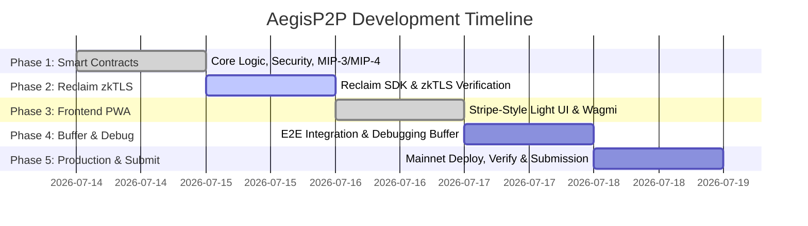

# AegisP2P: Implementation Roadmap

This document outlines the step-by-step phases to build and deploy **AegisP2P**, a ZK-Verified Fiat-to-Crypto Settlement Engine on Monad.

---

## Roadmap Overview

---

## **[In Progress] Phase 1: Smart Contract Foundations & Security (July 14 - July 15)**
**Objective:** Architect, secure, and deploy the core escrow engine.

*   [x] **1.1. Project Setup:** Initialize the codebase repository and configure Foundry/Hardhat in `contracts/`.
*   [x] **1.2. Core Escrow Contract (`AegisEscrow.sol`):**
    *   `createEscrow(buyer, amount, recipient, reference)` - payable function that creates and funds escrow in one transaction. Generates `paymentRef`.
    *   `verifyFiatAndRelease(escrowId, proof)` - verifies context string mapping and expected parameter JSON using case-safe hex string conversions and direct `keccak256(bytes)` hash comparisons.
    *   `refund(escrowId)` - simple timeout-based refund (2 hours). State-driven: checks `Funded` vs `AwaitingProof` timestamps.
    *   Escrow states: `Funded` -> `AwaitingProof` -> `Verified` / `Refunded`.
*   [x] **1.3. Define On-Chain Events:** Declared `EscrowFunded`, `PaymentMarked`, `FiatVerified`, and `EscrowRefunded`.
*   [x] **1.4. Security:**
    *   `ReentrancyGuard` on release and refund functions.
    *   `Ownable2Step` for admin controls only.
    *   `Pausable` - only blocks `createEscrow`. Release and refund are always unpausable to prevent owner-freezing of user assets.
    *   `usedClaims` mapping for complete replay protection.
*   [x] **1.5. Monad Network Integrations (MIP-3 & MIP-4):**
    *   **MIP-3 (Linear Memory):** Struct mapping and proof handling optimized using direct bytes casting in hash comparisons.
    *   **MIP-4 (Reserve Introspection):** staticcall check to address `0x1001` with `dippedIntoReserve()` selector (`0x3a61584e`). Fallback checks added to pass on non-Monad test environments.
*   [x] **1.6. Unit Testing:** Created `AegisEscrow.test.js` containing 22 unit tests covering all state transitions, timing constraints, reentrancy guards, and proof validations. All tests passing.
*   [ ] **1.7. Testnet Deployment:** Deploy to Monad Testnet and verify source code on explorer.

---

## **[Pending] Phase 2: Reclaim Protocol & zkTLS Configuration (July 15 - July 16)**
**Objective:** Configure Web2 data extraction and generate cryptographic proofs.

*   [ ] **2.1. Developer Setup:** Register app on Reclaim Developer Portal, get `APP_ID` and `APP_SECRET`.
*   [ ] **2.2. Configure HTTP Provider (Stripe Focus):**
    *   Target Stripe payment receipt pages for MVP.
    *   Map `parametersHash` from the Reclaim proof output.
*   [ ] **2.3. Signature Verification Tests:** Validate proof construction locally and confirm `parametersHash` matches smart contract expectations.
*   [x] **2.4. No on-chain string parsing:** Verification uses hash comparison only. Context strings and parameters are hashed directly on-chain and matched against proof inputs.

---

## **[Completed] Phase 3: Frontend PWA Development (July 16 - July 17)**
**Objective:** Design a premium, light-theme mobile web application and wire contract events.

*   [x] **3.1. Project Initialization:** Next.js App Router project with TypeScript and Tailwind CSS.
*   [x] **3.2. Neo-Banking UI:** Light-mode, high-contrast, Stripe/Revolut styled mobile UI. Custom `StateBadge`, `TimerDisplay`, and loading skeletons.
*   [x] **3.3. Wagmi/RainbowKit Setup:** Configured Wagmi client with `getDefaultConfig` and automatic `injected()` fallbacks targeting the Monad chain. Added client-side `mounted` checks to prevent hydration mismatches.
*   [x] **3.4. Features:**
    *   **Create Escrow:** Form locks MON and creates escrow in a single click.
    *   **Active Escrows:** Rendered dynamically using real-time contract reads and logs.
    *   **State Tracker Hooks:** Custom `useEscrows` hook that tracks state changes reactively by listening to contract events (`EscrowFunded`, `PaymentMarked`, `FiatVerified`, `EscrowRefunded`).
    *   **Role-Based Actions:** Disables and enables transaction buttons ("Mark as Paid", "Verify & Release", "Refund") depending on whether the current user is the buyer or seller.

---

## **[Pending] Phase 4: Integration & Debugging Buffer (July 17 - July 18)**
**Objective:** Bind components, debug, and optimize.

*   [ ] **4.1. Reclaim Frontend Integration:** Integrate the Reclaim client SDK into the frontend:
    *   Create a backend API route (`/api/reclaim/sign`) to securely sign proof requests using `RECLAIM_APP_SECRET`.
    *   Generate Reclaim QR codes for the buyer inside the UI to request Stripe payment receipt proof.
    *   Poll the Reclaim validation server or use WebSockets to receive the proof, encode it to ABI bytes, and call `verifyFiatAndRelease`.
*   [ ] **4.2. Full Flow Tests:** Deposit -> mark paid -> scan QR -> generate proof -> verify on-chain -> release.
*   [ ] **4.3. Debugging & Gas Optimization:** Fix async execution errors, RPC issues, edge cases.
*   [ ] **4.4. UI Audit:** Eliminate all mock data and hardcoded stats, ensuring every button triggers real on-chain state changes.

---

## **[Pending] Phase 5: Production Deploy, Verification & Submission (July 18 - July 19)**
**Objective:** Deploy to mainnet, publish, and present.

*   [ ] **5.1. Monad Mainnet Deployment:** Deploy finalized contract to Monad Mainnet (Chain ID `10143`).
*   [ ] **5.2. Source Code Verification:** Verify contract bytecode on Monad block explorer.
*   [ ] **5.3. Frontend Deployment:** Host PWA on Vercel or Netlify.
*   [ ] **5.4. Documentation (`README.md`):** Clear instructions to run the app within 3 minutes.
*   [ ] **5.5. Demo Video:** 3-minute walkthrough showing the problem and live transaction.
